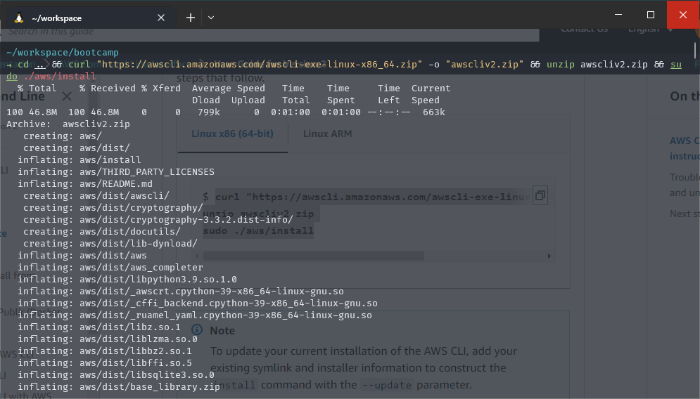
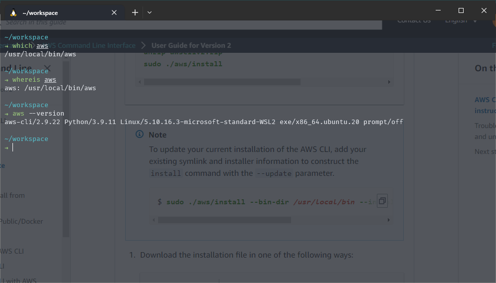

# Week 0 — Billing and Architecture

## Required Homework/Tasks

- [x] [Getting AWS CLI Working](#getting-aws-cli-working)
  - [x] [Install and Verify AWS CLI](#install-and-verify-aws-cli)
  - [x] [Create a new IAM User and generate an Access Key and Secret Key](#create-a-new-iam-user-and-generate-an-access-key-and-secret-key)
  - [x] [Configure AWS CLI with Access Key and Secret Key](#configure-aws-cli-with-access-key-and-secret-key)
  - [x] [Check if AWS CLI is working by running `aws sts get-caller-identity`](#check-if-aws-cli-is-working-by-running-aws-sts-get-caller-identity)
- [x] [Enable and Configure Billing Alerts](#enable-and-configure-billing-alerts)
  - [x] [Enable Billing Alerts](#enable-billing-alerts)
  - [x] [Create SNS Topic](#create-sns-topic)
  - [x] [Create a Billing Alarm](#create-a-billing-alarm)
- [x] [Create an AWS Budget](#create-an-aws-budget)
- [x] [Create conceptual design of the architecture](#create-conceptual-design-of-the-architecture)
- [x] [Create a logical design of the CI/CD pipeline and the architecture](#create-a-logical-design-of-the-cicd-pipeline-and-the-architecture)

## Getting AWS CLI Working

I was setting up my code environment on my local machine as I am more familiar with it.
My environment is using WSL2 running Ubuntu 20.04 LTS on Windows 10.
Thus I will provide instructions for Ubuntu Linux.

I did the following steps to install AWS CLI via the Ubuntu Linux terminal (zsh).

### Install and Verify AWS CLI

1. I installed the AWS CLI via the [AWS CLI Install Documentation Page](https://docs.aws.amazon.com/cli/latest/userguide/getting-started-install.html)
  Using the following command:

  ```sh
  curl "https://awscli.amazonaws.com/awscli-exe-linux-x86_64.zip" -o "awscliv2.zip" \
  unzip awscliv2.zip \
  sudo ./aws/install
  ```

  Proof of installation:
  

2. As I have previously installed the AWS CLI, I ran the following command to update it:

  ```sh
  sudo ./aws/install --bin-dir /usr/local/bin --install-dir /usr/local/aws-cli --update
  ```

3. I then ran the following command to verify the installation:

  ```sh
  aws --version
  ```

  

### Create a new IAM User and generate an Access Key and Secret Key

### Configure AWS CLI with Access Key and Secret Key

### Check if AWS CLI is working by running `aws sts get-caller-identity`

## Enable and Configure Billing Alerts

### Enable Billing Alerts

### Create SNS Topic

### Create a Billing Alarm

## Create an AWS Budget

## Create conceptual design of the architecture

## Create a logical design of the CI/CD pipeline and the architecture
